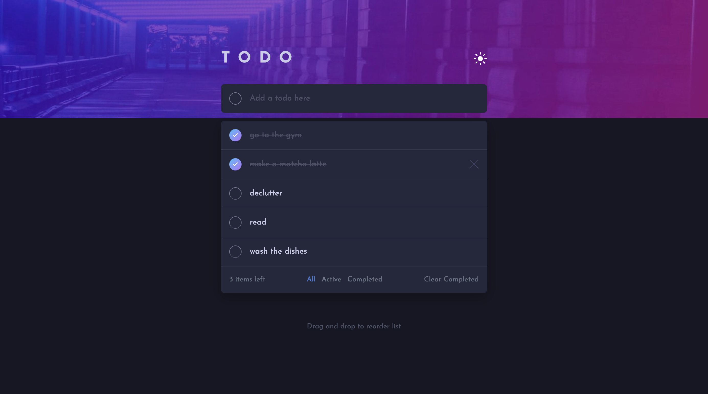
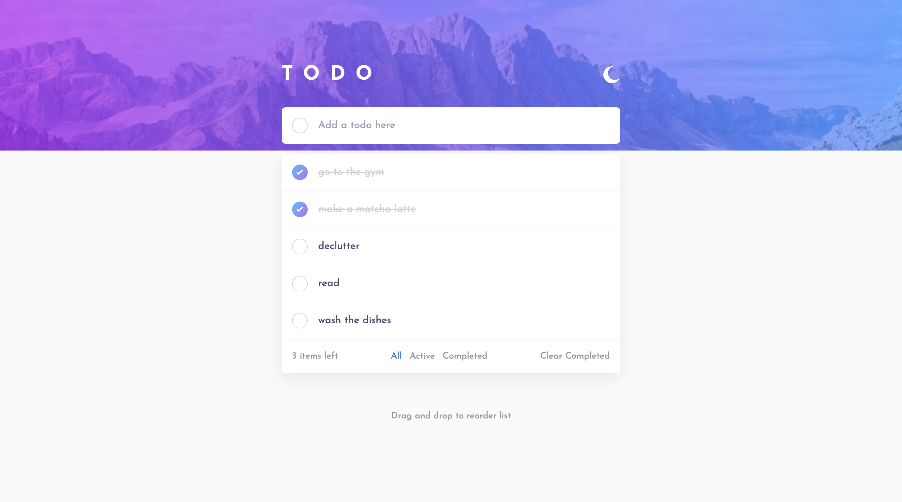

# Frontend Mentor - Todo app solution

This is a solution to the [Todo app challenge on Frontend Mentor](https://www.frontendmentor.io/challenges/todo-app-Su1_KokOW).

## Table of contents

- [Overview](#overview)
  - [The challenge](#the-challenge)
  - [Screenshot](#screenshot)
  - [Links](#links)
- [My process](#my-process)
  - [Built with](#built-with)
  - [What I learned](#what-i-learned)
  - [Continued development](#continued-development)
  - [Useful resources](#useful-resources)
- [Author](#author)
- [Acknowledgments](#acknowledgments)

## Overview

### The challenge

Users should be able to:

- View the optimal layout for the app depending on their device's screen size
- See hover states for all interactive elements on the page
- Add new todos to the list
- Mark todos as complete
- Delete todos from the list
- Filter by all/active/complete todos
- Clear all completed todos
- Toggle light and dark mode
- **Bonus**: Drag and drop to reorder items on the list

### Screenshot

### Links

- Solution URL: [https://github.com/piajuan/react-todo-app](https://github.com/piajuan/react-todo-app)
- Live Site URL: [https://react-todo-app-piajuan.vercel.app/](https://react-todo-app-piajuan.vercel.app/)

## My process

### Built with

- [React](https://reactjs.org/) - JS library
- [Tailwind](https://tailwindcss.com/) - CSS Framework

### What I learned

- How to setup a react project using [Vite](https://vitejs.dev/)
- The basics of react hooks such as useState, useEffect and useRef
- How to toggle the dark/light mode using Tailwind and useState
- How to reorder items on a list onDrag event

### Continued development

I had some challenges figuring out how to implement the filter feature and it's something I want to improve on in my future projects. 

### Useful resources

- [Codecedemy | Learn React Course](https://www.codecademy.com/enrolled/courses/react-101) - This helped me understand the fundamentals of react.
-[Learn React (Todo Project) by Web Dev Simplified](https://www.youtube.com/watch?v=hQAHSlTtcmY) - This YT tutorial introduced me to implementing react in a an actual project. This served as my guide in structuring my code. 

## Author

- Website - [Pia Juan](https://piajuan-portfolio.vercel.app/)
- Frontend Mentor - [@piajuan](https://www.frontendmentor.io/profile/piajuan)
- Twitter - [@piayadev](https://twitter.com/piayadev)

## Acknowledgments

I would like to acknowledge my partner who's also my mentor in React. He guided from the start, taught me some of the concepts of react hooks, and components. He also helped me when I'm stuck in some features of the project. 
